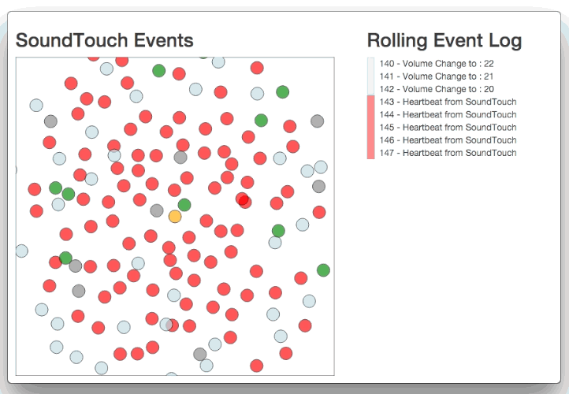
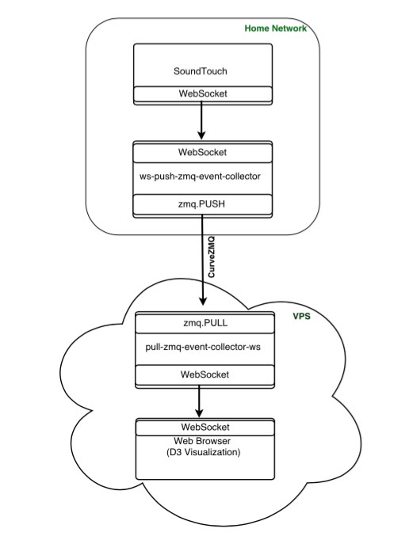

zmq-soundtouch
---------------
A series of projects exploring secure ZeroMQ connections and SoundTouch event data collection. Result  is the live SoundTouch event data visualization seen below. 

Main Project List : 
-------------------

1) - ./go/src/github.com/redsofa/`soundtouch` - Project that connects to Bose SoundTouch over WebSocket and pushes event notification messages to a secure ZeroMQ TCP PULL socket

2) - ./python/`publisher`.py - Project that connects to secure TCP PUSH socket, receives SoundTouch notifications and broadcasts them to subscribers.

3) - ./python/`cache`.py - Project that connects to ZeroMQ TCP PUB socket, creates a cache containing a list of recent SoundTouch notification messages	and makes them available over a ZeroMQ Router socket.

4) - ./go/src/github.com/redsofa/`collector` - Project that connects to ZeroMQ TCP PUB socket, receives notification messages and passes them on to WebSocket clients. Project also connects to ZeroMQ Router socket to get a list of most recent messages. In addition, it serves static web content.

Project Topology :
-------------------

License
-------

This project is licensed under AGPL V3. See COPYING file for a copy of the included license or visit http://www.gnu.org/licenses/.